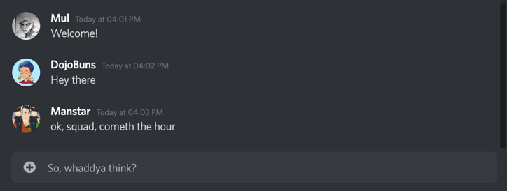

# Disarray


Artwork by [Tania Tiedemann](https://www.instagram.com/tatied.art/)

[Disarray](http://www.disarray-chat.herokuapp.com) is a clone of the popular chat app [Discord](http://www.discord.com). It allows users to create or join custom servers that can each contain multiple chat channels. Users can send instant messages on these channels and those messages will be broadcast to all members of that server, or they can choose to direct message other users. They can also befriend other users and then create group DMs with their friends.

## Technologies Used

Disarray was created with a Rails backend and a React frontend. Postgres was used for the database and Redux was used for frontend state management. Rails' ActionCable and Redis were used to integrate WebSockets into the application and allow for realtime chat, friend requests, and status updates. Redis was also used to cache frequently accessed data. The excellent [has_friendship](https://github.com/sungwoncho/has_friendship) gem was used to streamline the management of user friendships.

## Features

### User Authentication


Users can create an account and then use those same credentials to sign in in the future. Required fields are checked for presence errors on the frontend before a request is made, and then errors are displayed much as they are on Discord. A demo user also exists so that people can access the site and peruse its features without needing to sign up first.

### Servers


Users can create or join a server to chat with their friends. Each server can have multiple distinct chat channels.

### Chat



Chat messages are broadcast out to all server or direct message members in real time.


Users can edit or delete their messages and those changes are reflected to others in real time.

### Friends


Users can send and accept friend requests.


Users can invite their friends to group DMs.

## Challenges

### Infinite Scroll in a Chat Channel

One of the biggest obstacles I encountered was implementing infinite scroll in chat channels to lazy load earlier messages in the history. Now, I know what you're thinking: "Infinite scroll? But that's easy!" And indeed it is. But my chat component uses refs to scroll to the bottom of the chat whenever a new message is received using `element.scrollIntoView()`, and this behavior proved to be problematic when attempting to load earlier messages. The user would scroll to the top of the chat, triggering a request to fetch a batch of earlier messages, but when the chat component was updated to include those messages, the most recent message would scroll into view, causing the scrollbar to jump all the way back to the bottom of the component, and forcing the user to have to scroll all the way back up in order to view the messages they requested. Not very user-friendly!

To get past this issue, I needed to find a way to temporarily disable the scroll into view call when earlier messages were being fetched. To accomplish this I created `loading` and `scrolling` slices of local state:

```js
class ChatStream extends React.Component {
  constructor(props) {
    super(props);
    this.state = {
      loading: false,
      scrolling: false,
    };
```

When the scrollbar reaches the top of the chat, both `loading` and `scrolling` get set to `true`. I also adjusted my `componentDidUpdate` method to fetch more messages when `loading` changed from `false` to `true`, and for the last message in the chat to scroll into view only when `scrolling` was set to `false`:

```js
if (this.state.loading && !prevState.loading) {
  this.handleLoad();
} else if (this.bottom.current && !this.state.scrolling) {
  this.bottom.current.scrollIntoView();
}
```

This fixed the issue of the scrollbar jumping to the bottom of the component when earlier messages were loaded, however, it was now doing the opposite——it would jump to the top of the chat instead! You know how the old saying goes, _one step forward, two steps back_.... I did some digging and found that React has a (somewhat obscure) lifecycle method specifically for such a usecase. (And herein lies the reason this is a class component and not a functional one as I would have preferred.) So I used the `getSnapshotBeforeUpdate` method to check if the first message in the component's current props was different than the first one in the previous props, and if so, to return the scroll height of the chat before the new messages were added. Otherwise, return null.

```js
getSnapshotBeforeUpdate(prevProps) {
    if (
      prevProps.messages[0].id !== this.props.messages[0].id
    ) {
      return this.scroller.current.scrollHeight;
    }
    return null;
  }
```

The return value from this method actually gets passed to `componentDidUpdate` as an argument with the parameter `snapshot`. With that in mind, I tweaked my update method to check if a snapshot was present, and if so, to get the new scroll height of the chat and set the scrollbar to the difference between the new height and the previous height, thus retaining the user's scroll position in the chat history. Once this was done, I set `loading` to `false`.

```js
if (snapshot) {
  this.scroller.current.scrollTop =
    this.scroller.current.scrollHeight - snapshot;
  this.setState({ loading: false });
}
```

I also incorporated a banner like Discord does to signal to the user that they were viewing older messages when `scrolling` is set to `true`. By clicking it, they could set it back to `false`, which would cause the scroll bar to jump back all the way to the bottom of the chat and reinitiate the scroll into view behavior for new messages. So ended my long odyssey to load earlier messages on scroll!


### Managing WebSockets

The application's dependence on WebSockets was originally limited to chat functionality, so the user would initially only be subscribed to a chat channel or direct message in an on mount `useEffect` on the `TextChannel` and `Conversation` components. However, this was suboptimal. You would only be subscribed to a channel once you navigated to it and that subscription would be overwritten when you navigated back. In addition, I found that I was repeating API calls to fetch information each time I navigated around the app. I wanted to subscribe the user to all the relevant ActionCable channels when they logged in, and then let WebSockets do their work to keep the user's servers, channels, messages, direct messages, and friends up to date. In effect this meant frontloading the data sent to the user on sign in to include their associated servers, channels, and direct messages, and then using that information to create all their subscriptions at once. So I added a `useEffect` to my `Application` component (renamed due to conflicts with the Rails `App` global variable that we need to use to create a subscription) that will only be run when the user has signed in and the WebSocket connection is active:

```js
useEffect(() => {
  if (loggedIn && App) {
    appearanceSub(user.id, receiveStatus);
    friendsSub(user.id, friendActions);
    serverSubs(servers, serverActions, messageActions, receiveSub);
    convoChannelSub(user.id, receiveConversation, messageActions, receiveSub);
    convoSubs(convos, messageActions, receiveSub);
  }
}, [loggedIn, Boolean(App)]);
```

These functions are imported in from a `socket_util` file in order to keep the component tidy. They are passed some identifying information to use in order to subscribe to the correct channel as well as any actions that will need to be dispatched. In the case of `serverSubs`, it is passed an array of the user's servers, which it will then iterate through and for each of them it will subscribe to the server's ActionCable channel in order to receive any changes that happen to the server itself, like if a chat channel is added or if the server is renamed:

```js
 App.server = App.cable.subscriptions.create(
    { channel: "ServerChannel", id: s.id },
    {
      received: (data) => { ... },
    }
  );
  sub({ id: s.id, subType: "Server", sub: App.server });
  s.channels.forEach((c) => channelSub(c, receiveMessage, removeMessage, sub));
  delete App.server;
```

It temporarily stores the subscription on the global variable and then dispatches it to the Redux store so that if the server is deleted or the user leaves, they will be unsubscribed from it. It then iterates through the server's chat channels and subscribes to each of them, and then dispatches those subscriptions to the Redux store as well so that the appropriate components can retrieve them in order to use the subscription's `speak` method to send messages to the correct channel:

```js
const channelSub = (id, receive, remove, sub) => {
  App.channel = App.cable.subscriptions.create(
    { channel: "ChatChannel", channel_id: id },
    {
      received: (data) => (data.remove ? remove(data) : receive(data)),
      speak(data) {
        return this.perform("speak", data);
      },
    }
  );
  sub({ id, subType: "Channel", sub: App.channel });
  delete App.channel;
};
```

And with that I was able to implement a system where a user will be subscribed to all the necessary channels right when they sign in (or when they open up the app if they have a valid session token), and as a result I was able to majorly cut down on the number of API requests the application makes during a browsing session. I also made sure to allow for the creation of new subscriptions during a session, like when a user joins a new server or starts a new direct message.

### Overflow & Tooltips

One of the least expected challenges I encountered in this project was properly positioning and displaying tooltips. Discord has a number of tooltips throughout their application that appear when you hover specific components, like the server icons on the vertical bar on the far left, or on the icons on the horizontal navbar at the very top. Initially, implementing them was relatively straightforward, as simple as setting the outer tooltip div to `position: relative` and the content to `position: absolute`. The problem arose when tooltips needed to be inside containers with `overflow-y: scroll`. By design, when an element's overflow is set to scroll in one direction, the overflow in the other direction is set to auto. In the case of the server bar, this meant none of the tooltips would be visible as they were situated outside the container's x-axis.

I did some Googling but wasn't able to find a direct solution to my problem, but I did come across a [tip](https://css-tricks.com/popping-hidden-overflow/) to wrap the scrollable element in a div with `position: relative`, and then use
`position: absolute` on the tooltip to position it in relation to the parent wrapper and allow the tooltip to appear outside the scrollable element's margins. In order to make this work in the case of the server bar, I would have to dynamically set the top and left properties of the tooltips using the position of the server icons on the screen. This seemed like a good opportunity to use a ref! So I created a ref to the server icon button and passed it to the tooltip component as a prop.

```js
const ServerBarIcon = ({ server, active }) => {
  const [tooltip, setTooltip] = useState(false);
  const el = useRef(null);

  const toggleTooltip = (bool) => () => setTooltip(bool);

  return (
    <div>
      <button
        className={active ? "server-icon active" : "server-icon"}
        type="button"
        onMouseOver={toggleTooltip(true)}
        onFocus={toggleTooltip(true)}
        onMouseOut={toggleTooltip(false)}
        onBlur={toggleTooltip(false)}
        ref={el}
      >
        {!server.icon && <h1>{initials}</h1>}
      </button>
      {tooltip && <Tooltip text={server.name} className="sb-tt" el={el} />}
    </div>
  );
};
```

In the tooltip component, I used `element.getBoundingClientRect()` to get the distance from the top of the viewport to the bottom of the element, then subtracted half the height of the tooltip and half the element's height, and incorporated that into an inline style to line the tooltip up with the proper element, like so:

```js
<div
  className={`tooltip ${className}`}
  style={{ top: `${bottom - 17.5 - height / 2}px` }}
>
```

And just like that, I had visible tooltips in an `overflow-y: scroll` container!


## Future Directions

I hope to add functionality for notifications, pinned messages, mentions, and then finally tackle voice chat in the near future. I honestly can't wait!

Thank you for taking the time to look through this README. Please don't hesitate to get in touch if you found it interesting.
